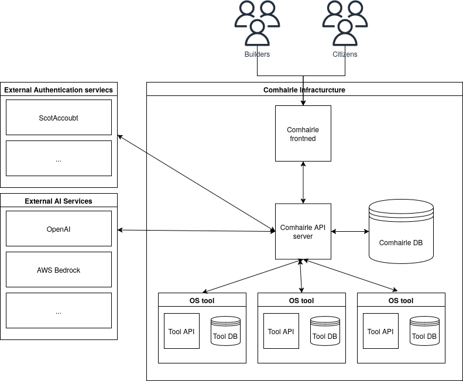
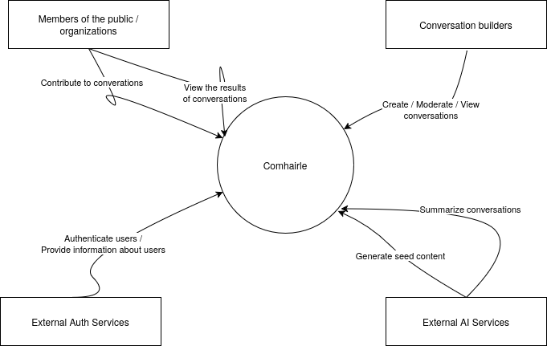

# Comhairle Technical Documentation

- [High-Level Architectural Overview Diagrams](#high-level-architectural-overview-diagrams)
  - [Descriptions of Each Component](#descriptions-of-each-component)
    - [Comhairle API Server](#comhairle-api-server)
    - [Comhairle Frontend](#comhairle-frontend)
    - [Comhairle Database](#comhairle-database)
    - [Open Source Tools](#open-source-tools)
    - [External Authentication Services](#external-authentication-services)
    - [External AI Services](#external-ai-services)
- [System Context Diagram](#system-context-diagram)
  - [Descriptions of Each Component](#descriptions-of-each-component-1)
    - [Conversations](#conversations)
    - [Citizens/Organizations](#citizensorganizations)
    - [Conversation Builders](#conversation-builders)
    - [External Authentication Services](#external-authentication-services-1)
    - [External AI Services](#external-ai-services-1)
- [Tech Stack](#tech-stack)
  - [Database Server](#database-server)
  - [API Server](#api-server)
  - [Frontend](#frontend)
  - [Polis (Tool)](#polis-tool)
  - [HeyForms (Tool)](#heyforms-tool)
- [Coding/Engineering Approach](#codingengineering-approach)
  - [Deployment and Orchestration](#deployment-and-orchestration)
  - [Environments](#environments)
  - [GitFlow](#gitflow)
  - [CI/CD](#cicd)
  - [Testing](#testing)
- [Functionality Expected for MVP](#functionality-expected-for-mvp)
- [Functionality to Be Developed in the Pre-Commercialization Phase](#functionality-to-be-developed-in-the-pre-commercialization-phase)

# High-Level Architectural Overview Diagrams

## Descriptions of Each Component

### Comhairle API Server

The API server is written in Rust and handles:

- Authentication/Authorization in the following forms:
  - Login/Signup via email and password
  - Pseudo-anonymous login, where users are given a randomly generated ID under which they can participate
  - Login/Signup via third-party OpenID and OAuth solutions such as ScotAccount
- Communication with third-party tools like Polis, HeyForm, etc.
- Communication with the database.

### Comhairle Frontend

The frontend server is a SvelteKit server written in TypeScript. It:

- Is the primary way both Conversation Builders and the public interact with the system
- Provides Server-Side Rendered content and handles page routing
- Communicates with the API server to retrieve and update relevant content
- Handles authentication between the frontend and backend using JWT.

### Comhairle Database

The database stores all necessary data for running the system, including:

- User accounts for both citizens participating and Conversation Builders/Facilitators.
- Conversation details, including contextual information and the details of each step in the conversation.
- A unified data store containing data produced by third-party tools.

### Open Source Tools

A key aspect of our solution is integrating with existing open-source tools for deliberative democracy. These tools, along with any supporting databases and services, are containerized and run within our Kubernetes (K8s) cluster.

For the most part, direct access to these tools will be avoided, with users interacting through our frontend via the API server. For some tools, we may embed access via IFrames.

### External Authentication Services

While the platform will allow direct email/password-based authentication, we aim to support additional authentication methods. These will vary depending on the client, but for the Scottish Government, they may include:

- **ScotAccount**: The Scottish digital identity system
- **VeriFox**: A privacy-preserving identity system

We plan to support OAuth and OpenID Connect-based solutions.

### External AI Services

Several of the open-source tools we are integrating, along with the platform itself, will require access to LLM-based tools. We will rely on external services to provide these tools, which may include external APIs like OpenAI, as well as self-hosted models through systems like AWS Bedrock.

# System Context Diagram

## Descriptions of Each Component

### Conversations

The core unit of engagement on the platform. A series of steps that contributing users go through to provide their views on a given piece of policy or other decision.

### Citizens/Organizations

Users participating in conversations within the system. They may be individuals or interest groups such as activist groups, industry groups, etc.

### Conversation Builders

Members of policy teams/support groups who are interested in learning about citizens' and organizations' views on a topic. They can create, moderate, and view the results of conversations on the platform.

### External Authentication Services

These are third-party services, such as ScotAccount and others, which implement protocols like OpenID Connect to allow users to authenticate with the platform and potentially provide user details.

These services will depend on the client and the authentication methods they prefer to support.

### External AI Services

Some of the open-source tools and the core platform itself will require external LLM-based tools for activities such as:

- Summarizing large numbers of statements
- Generating and grouping user-generated content
- Generating seed content for conversations
- Allowing users to quickly request and receive information about conversation topics
- Checking the readability of contextual information provided by Conversation Builders
- Other related tasks

# Tech Stack

### Database Server

- [PostgreSQL](https://www.postgresql.org/)

### API Server

- Written in Rust using the [Axum](https://github.com/tokio-rs/axum) web framework
- Interaction with the database via [SQLx](https://github.com/launchbadge/sqlx) and [SeaQuery](https://github.com/SeaQL/sea-query)

### Frontend

- Written using [SvelteKit](https://svelte.dev/) with TypeScript
- Uses [ShadCN](https://www.shadcn-svelte.com/) as a component library
- [Tailwind](https://tailwindcss.com/) for styling

### Polis (Tool)

- DB: PostgreSQL
- API: Node.js
- Frontend: Combination of React, vanilla JS, and HTML
- MathServer: Written in Clojure

### HeyForms (Tool)

- DB: MongoDB and KeyDB
- API: Node.js written in TypeScript

# Coding/Engineering Approach

## Deployment and Orchestration

- Kubernetes (K8s) cluster (AWS EKS) managed by `eksctl` and Helm charts

## Environments

We have two deployment environments (excluding testing):

1. **Production**: The deployed application at [https://comhairle.scot](https://comhairle.scot)
2. **Staging**: A staged version of the application at [https://stage.comhairle.scot](https://stage.comhairle.scot)

These are managed through different namespaces on the K8s cluster, defined and controlled through different values files in the Helm charts repository.

## GitFlow

New features should have their own branch with a name referencing the ticket where the feature is described.

Pull requests should be made against `staging` for automatic and manual testing.

Features will be released in batches to the main site using a tagged release schedule. During the accelerator phase, this will coincide with our two-week sprints.

## CI/CD

We adopt a Continuous Integration and Deployment (CI/CD) strategy.
