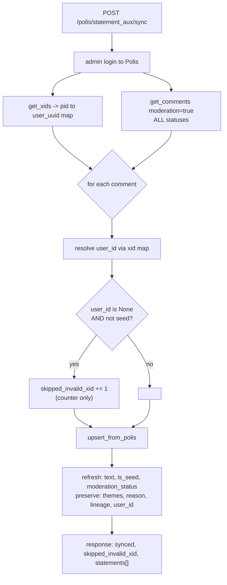

# Polis statement sync, moderation, and Insights: how it actually works

A developer-facing map of the whole Polis statement lifecycle: the `polis_statement_aux`
sidecar table, how sync pulls from Polis, what `skipped_invalid_xid` really counts, the
split / reword flow, and why a freshly added statement does not show up in the Insights
CSV until someone votes on it.

This exists because the flow spans two systems (Comhairle and a self-hosted Polis) and
three different notions of "a statement exists", and it is easy to mistake correct
behaviour for a bug. If you only read one thing, read
[The two-axis mental model](#the-two-axis-mental-model).

Related: [ADR-0003](adr/0003-native-polis-admin-config-proxy.md) (admin config proxy),
[ADR-0011](adr/0011-split-statements-post-non-seed-derived-with-lineage.md) (split),
[ADR-0015](adr/0015-reject-reason-is-a-preset-label-in-free-text.md) (reject reason), and
the glossary entries in [CONTEXT.md](../CONTEXT.md) (`Polis statement aux`, `Seed
statement`, `Derived statement`, `Split`, `Moderation status`).

## TL;DR

- Comhairle keeps a **sidecar table**, `polis_statement_aux`, with one row per Polis
  statement. It holds admin-only metadata Polis does not store (moderation status,
  themes, seed flag, reject reason, lineage, participant attribution).
- **Sync** logs in as the Polis admin, pulls every comment (accepted, pending, and
  rejected) plus the participant `xid` map, and upserts one aux row per comment. Nothing
  is deleted or excluded on sync.
- **`skipped_invalid_xid` is a misnomer.** Nothing is skipped from the sync. It is a
  counter of non-seed statements that could not be attributed to a Comhairle participant
  account (no `xid`). Those statements are still stored. In practice these are almost
  always admin-authored split / reword replacements.
- **Participant visibility** is decided entirely by the statement's Polis moderation
  status (accepted = votable now). The aux table and the Insights report do not affect
  what participants see.
- **The Insights view and its CSV are built from Polis's opinion-analysis math**
  (`math/pca2`), not from the aux table. A statement only becomes a report row once it
  has at least one vote (so it appears in the PCA matrix) and is accepted. A zero-vote
  statement is correctly absent from the report until voted on. This is not data loss.

## The players

| Term | What it is | Where |
| --- | --- | --- |
| **Polis** | The self-hosted deliberation engine (`polis.comhairle.scot`). Owns statements, votes, moderation status, and the opinion math. Comhairle talks to it over HTTP as an admin. | `api/src/wiki_poll_service/polis_service.rs` |
| **`pid`** | Polis **participant id**, unique within one conversation. Every actor with a presence in a conversation has one, including the admin. | Polis |
| **`xid`** | Polis **external id**: an arbitrary string an outside system binds to a participant. Comhairle stores the participant's **Comhairle user UUID** here. It is the only bridge from a Polis `pid` back to a Comhairle account. | `PolisApi.ts`, `get_xids` |
| **`tid`** | Polis statement (comment) id, unique within a conversation. | Polis |
| **Seed** | A statement authored by the moderator to spark discussion (`is_seed: true`). Polis auto-approves seeds on post. | [CONTEXT.md](../CONTEXT.md) |
| **Derived statement** | A statement the moderator authors while splitting / rewording a participant statement (`is_seed: false`, `original_statement_id` set). Real and votable, never a host seed. | [ADR-0011](adr/0011-split-statements-post-non-seed-derived-with-lineage.md) |
| **`polis_statement_aux`** | Comhairle's sidecar table, one row per Polis statement. | `api/src/models/polis_statement_aux.rs` |

### Preview poll vs live poll

A Polis step is backed by **two** separate Polis conversations: a **preview** poll (used
while the Conversation is a draft, admin only) and a **live** poll (created at launch,
where participants actually vote). Sync and moderation target whichever one matches
`conversation.is_live` (`tool_config` for live, `preview_tool_config` for preview). Real
participant voting is post-launch only, so before launch the Insights report is empty by
definition (there are no votes yet). See `CONTEXT.md` and `sync_statement_aux` in
`api/src/tools/polis.rs`.

## Why the aux table exists

Polis stores the statement text, the seed flag, and a moderation status. It does **not**
store anything else Comhairle needs for policy-team workflows. `polis_statement_aux`
carries that extra state:

- `moderation_status` (`accepted` / `pending` / `rejected`), mirrored from Polis but
  usable in filters and reports without a round trip.
- `themes: string[]`: human-authored topic tags. Polis has no theme concept.
- `moderation_reason`: the preset label recorded on a reject ([ADR-0015](adr/0015-reject-reason-is-a-preset-label-in-free-text.md)).
- `visible_statement_when_submitted`: what the participant saw at submission time.
- `original_statement_id`: self-referential lineage for a derived statement (split /
  reword), pointing at the aux row it came from ([ADR-0011](adr/0011-split-statements-post-non-seed-derived-with-lineage.md)).
- `user_id`: the Comhairle account the statement is attributed to, resolved through the
  `xid` map. `NULL` for seeds, derived statements, and any statement whose participant has
  no `xid`.

The invariant: **sync refreshes the fields Polis owns and preserves the fields Comhairle
owns.** See `upsert_from_polis` (`api/src/models/polis_statement_aux.rs`): the
`ON CONFLICT (workflow_step_id, polis_statement_id)` update touches only
`statement_text`, `is_seed`, and `moderation_status`. Everything else (`moderation_reason`,
`themes`, `visible_statement_when_submitted`, `original_statement_id`, `user_id`) is left
untouched because it is absent from `update_columns`.

## The sync flow

Endpoint: `POST /polis/statement_aux/sync` -> `sync_statement_aux` ->
`sync_statement_aux_inner` (`api/src/tools/polis.rs`). Also run automatically on launch so
going live seeds the aux table immediately.

1. **Log in** to Polis with the admin credentials from the step's Polis config.
2. **Fetch the xid map**: `get_xids(poll_id)` returns `{ pid, xid }` rows. Each `xid` is
   parsed as a UUID; unparseable ones are dropped. Result is a `HashMap<pid, user_uuid>`.
3. **Fetch every comment**: `get_comments(poll_id)` calls
   `/api/v3/comments?...&moderation=true`. The `moderation=true` flag is what makes Polis
   return **all** statements: accepted (`mod: 1`), pending (`mod: 0`), and rejected
   (`mod: -1`). Without it Polis returns only accepted ones, and the sync would never see
   rejected or pending statements.
4. **Upsert one aux row per comment**. For each comment:
   - Resolve `user_id = pid_to_user_id.get(comment.pid)` (may be `None`).
   - If `user_id.is_none() && !comment.is_seed`, increment `skipped_invalid_xid`. **This
     does not skip the row.** The row is upserted regardless, on the very next lines.
   - `upsert_from_polis(...)` writes / refreshes the aux row.
5. Return `{ synced, skipped_invalid_xid, statements }`. `synced == statements.len() ==`
   the number of comments Polis returned.



### What `skipped_invalid_xid` really means

It is the count of statements that are **not seeds** and **could not be attributed to a
Comhairle participant account** because their Polis `pid` has no `xid` mapping. The row is
still synced and still returned; only the attribution (`user_id`) is left `NULL`.

Why would a non-seed statement have no `xid`?

- **Split / reword replacements** (the common case). They are posted server-side under the
  admin account (`"pid": "mypid"`), which never goes through the participant `?xid=` flow,
  so Polis has no `xid` for them. See [the split flow](#the-split--reword-flow).
- Any statement authored by a Polis participant who was created outside Comhairle's embed
  (should not happen in normal operation, but the counter would catch it).

Seeds are deliberately excluded from the count: a seed has no participant author by design,
so a missing `xid` is expected and uninteresting.

**The user-facing wording is the one genuine wart.** `PolisModeration.svelte` renders the
toast as `Synced N statements from Polis (M skipped)`. Nothing was skipped. A more honest
phrasing is "M not linked to a participant account", or simply dropping the parenthetical.
See [Known issues](#known-issues-and-follow-ups).

## The moderation flow

Endpoints: `POST /polis/statement_aux/{id}/moderate` (single) and
`POST /polis/statement_aux/moderate_batch` (many), both in `api/src/tools/polis.rs`.

1. Authorize (`check_can_moderate`: caller must be able to update the conversation).
2. Forward the decision to Polis: `moderate_comment(poll_id, tid, status)` sends
   `PUT /api/v3/comments` with `mod: 1` (accept) or `mod: -1` (reject) and
   `active: true/false`.
3. Persist locally via `moderate` / `moderate_many`. On **accept**, the reject reason is
   always cleared to `NULL`; on **reject**, the supplied reason is stored. This is the
   ADR-0015 invariant, centralised in `reason_for_decision` and `moderation_values` so the
   single and batch paths cannot drift.

Polis is written first, then the local mirror, so a failed Polis call leaves the local
status unchanged rather than lying about a decision that did not take.

## The split / reword flow

Endpoint: `POST /polis/statement_aux/{id}/split` -> `split_statement`
(`api/src/tools/polis.rs`). Full rationale in
[ADR-0011](adr/0011-split-statements-post-non-seed-derived-with-lineage.md). A "reword" is
just a split with a single replacement.

Polis has no edit-in-place, so a reword is unavoidably "new statement(s) plus a rejection
of the old one". The sequence is ordered to **fail safe**:

1. **Post** each replacement with `is_seed: false` (a real, votable, non-host statement).
2. **Auto-accept** each replacement (`mod: 1`) so it is immediately votable rather than
   dropped into the pending queue. The admin authored it deliberately.
3. **Reject** the original (`mod: -1`) only after every replacement has landed, and set its
   `moderation_reason` to a system note (`Reworded/split by moderator into N statement(s)`).
4. **Record lineage locally** in one DB transaction (`record_split`): insert each derived
   row with `original_statement_id` and `moderation_status = accepted`, and flip the
   original to rejected.

Because replacements are posted under the admin account, they arrive with the admin's
`pid` and no `xid`. On the next sync they therefore show `user_id: null`, `is_seed: false`,
and get counted in `skipped_invalid_xid`. That is expected: a derived statement is
moderator-authored and is not attributed to a participant. Its lineage
(`original_statement_id`) is preserved across sync because it is a Comhairle-owned field.

`record_split` upserts derived rows on `(workflow_step_id, polis_statement_id)` so that if
a concurrent sync already pulled the freshly posted replacement in as a plain row, the
split enriches it with lineage instead of conflicting.

### Cross-system atomicity

The **local** aux writes are atomic (one transaction). The **cross-system** sequence
(Polis post, accept, reject, then the local transaction) cannot be. On partial failure the
error surfaces as-is with no fake rollback; reject is idempotent so a retry is safe. Worst
residual case is an orphan accepted replacement plus a still-live original, both visible
and fixable by hand, never a lost statement.

## Insights, the report, and the CSV

This is the part most often mistaken for a bug.

**The Insights view and its "Download CSV" are not built from `polis_statement_aux`.** They
are built from Polis's opinion-analysis math. Data flow:

- Loader `insights-loader.ts` fetches two things: `PolisListStatementAux` (all aux rows,
  used only to overlay themes) and `PolisGetReportData` (the actual report).
- `GET /polis/report_data` -> `get_report_data` calls, in Polis:
  - `get_math_pca` -> `/api/v3/math/pca2` (the PCA / clustering output), and
  - `get_comments_with_voting` -> `/api/v3/comments?...&include_voting_patterns=true`.
  - `transform_report_data` merges them into a `WikiPollReport`.
- `PolisInsights.svelte` builds the CSV client-side, one row per entry in
  `reportData.comments`. The aux map only enriches existing rows (adds themes); it never
  adds a row.

The row set is decided in `transform_report_data`
(`api/src/wiki_poll_service/polis_service.rs`):

```rust
// Driven by the PCA tids, not the raw comment list.
for (idx, &tid) in math_pca.tids.iter().enumerate() {
    ...
    // Only accepted comments have vote counts / seed flags recorded.
    if let (Some(overall_votes), Some(is_seed)) =
        (comment_votes.get(&tid), comment_is_seed.get(&tid))
    {
        comments_report.push(CommentReportData { tid, text, overall_votes, ... });
    }
}
```

So a statement is a report row (and therefore a CSV row) only if **both**:

1. Its `tid` is in `math_pca.tids`. Polis's math only lists statements that appear in the
   vote matrix, that is, statements **with at least one vote**. A zero-vote statement has
   no column in the matrix and is absent from `tids`.
2. It is **accepted** (`moderation > 0`). The vote-count and seed-flag maps are only
   populated for accepted comments.

That is the whole explanation for the reported symptom: a just-added or just-split
statement is accepted (so participants can vote on it right away), but until at least one
vote lands it is not in the PCA matrix, so it is not in the report or the CSV. Cast one
vote on it and it appears. Nothing was lost; the analysis engine simply had nothing to
analyse yet.

## The two-axis mental model

Hold these two axes separate and the whole system stops looking buggy:

| Question | Decided by | Where it lives |
| --- | --- | --- |
| **Can participants see and vote on this statement?** | Polis **moderation status**. Accepted = yes, right now. | Polis, mirrored in `moderation_status` |
| **Does this statement appear in Insights / the CSV?** | Polis **opinion math**: it needs at least one vote (to enter `math/pca2` tids) and must be accepted. | `math/pca2`, via `get_report_data` |

A split replacement is accepted the instant it is created, so it is on the first axis
immediately. It joins the second axis only once someone votes on it. Both behaviours are
correct and independent.

## Edge cases and known gaps

- **Launch does not carry aux metadata.** Launch migrates only seed **text** (via
  `post_seed_comment`) into the fresh live poll. It does **not** carry over
  `moderation_status` or `themes`, and it does not yet filter out rejected seeds
  (there is a `// TODO: filter seed statements`). So pre-launch moderation and theming do
  not survive launch. Known backend gap, tracked separately from the tab UI work. See
  `CONTEXT.md`.
- **`user_id` is resolved once and never re-resolved.** `upsert_from_polis` preserves
  `user_id` across sync (it is not in `update_columns`). If a statement is ever first
  synced before its author's `xid` is registered, its attribution stays `NULL` even after
  the `xid` later appears. In normal operation a participant always has an `xid` by the
  time they can submit a statement (the embed registers it via `participationInit?xid=`
  before any write), so this is a latent edge, not an observed one. If it ever bites, the
  fix is to add `user_id` to the conflict update with a `COALESCE`-style "fill only when
  currently null" rule rather than a blind overwrite.
- **Rejected statements stay in the aux table.** `get_comments` returns rejected comments,
  so a split original remains as a `rejected` aux row with its split reason, which is the
  audit trail we want. It is correctly excluded from Insights (not accepted).
- **The "skipped" toast wording** is misleading, as covered above.
- **`PolisApi.ts` truthiness on `pid === 0`.** The identity guard `this._pid ? {pid} :
  {xid: this.userId}` is falsy when `pid` is `0`, so a participant who happened to be
  `pid 0` would fall back to sending the `xid`. `pid 0` is the conversation owner / admin
  slot and should not occur in the participant embed, so this is low risk, but it is a
  truthiness check where an explicit `!== undefined` (as used elsewhere in the same file)
  would be safer.

## Known issues and follow-ups

- **Reword the sync toast.** `PolisModeration.svelte` should not say "skipped"; nothing is
  skipped. Prefer "M not linked to a participant account" or drop the parenthetical. If the
  count has no user value at all, consider removing it from the response surface.
- **Launch metadata migration** (moderation status, themes) and **rejected-seed filtering**
  at launch remain open (see edge cases).

## Verification against a real sync payload

Using the two sync responses captured during the audit (poll `9yyy7tsn7a` and
`8mevkmnivs`):

- Response A: `synced: 12`, `skipped_invalid_xid: 3`. The `statements` array has 12
  entries. Exactly 3 of them are `is_seed: false` with `user_id: null` (`"OW"`, `"ME"`,
  `"Me OW"`). The one non-seed statement with a real `user_id` (`"MEO W"`) is not counted.
- Response B (after splitting `"MEO W"` into `"hell otest"`): `synced: 13`,
  `skipped_invalid_xid: 4`. The array has 13 entries; the new derived `"hell otest"`
  (`is_seed: false`, `user_id: null`, `original_statement_id` set, `accepted`) pushes the
  count to 4. `"MEO W"` is now `rejected` with reason
  `Reworded/split by moderator into 1 statement(s)`.

Both counts match "non-seed statements with no participant attribution", and in both cases
every counted statement is present in the synced array. The counter is descriptive, not an
exclusion.
